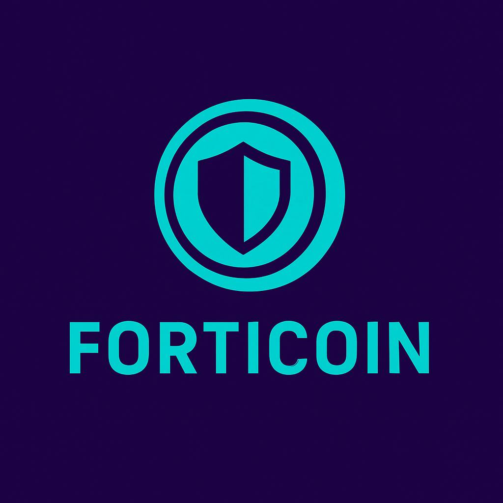

  

# Forticoin

**Forticoin** is an innovative token that combines a **base asset** (Bitcoin, Ethereum, or others) with a **put option** on the same asset and in the same volume.  
It is designed to minimize risks while preserving upside potential, making long-term cryptocurrency investments more secure and predictable.
---

## 📖 Concept

The project aims to create a token that includes both a cryptocurrency (e.g., Bitcoin, Ethereum) and a **put option** on the same asset.  
The expiration date of the option depends on the token type, allowing investors to choose the most suitable product.  

### Example  
On **September 1, 2025**, an investor buys **1 BTC** at $109,000 and simultaneously buys a **put option** with a strike price of $110,000 for $13,600, expiring on **June 26, 2026**.  
As a result, the investor receives **1 FORTICOIN** (1 BTC + 1 put option) worth **$122,600** at a BTC price of $109,000.  

#### Two scenarios:  
1. **BTC falls to $80,000** → 1 FORTICOIN ≈ **$95,400 – $95,700**, depending on the option’s premium.  
2. **BTC rises** → 1 FORTICOIN = BTC price + residual option value (depends on price and time to expiration).  

Closing a position (or part of it) is possible at any time without restrictions.  

This is a basic example. In practice, there are many variations of the token — with different cryptocurrencies, option maturities, and strategies.  
The same principle also applies to **bearish investments** (profiting from market declines).

---

## 💡 Why Forticoin?

### 1. Investment  
Cryptocurrencies are highly volatile, which prevents many individuals and companies from making long-term investments.  
Our token minimizes risk of losses while keeping the upside potential.  
The second stage of the project is the creation of an **investment fund and community** with open strategies and ideas built on FORTICOIN.

### 2. DeFi  
Forticoin is an excellent tool for medium- and long-term loans.  
Borrowers can be sure their collateralized positions will not be liquidated automatically, since the loss cannot exceed the option cost.  
This enables parallel **borrowing and investing**, effectively giving **double utility** to assets — something impossible in traditional finance.  
Currently, Forticoin offers a unique combination of **safety, investment opportunities, and credit tools** unmatched in the stock or commodities markets.

### 3. Payments & Contracts  
Sometimes work must be done or goods delivered today, while payment will only come in the future.  
Forticoin eliminates the risk of overpayment for the payer and the risk of devaluation for the receiver in a volatile market.  
This significantly broadens the scope of cryptocurrency usage and attracts more participants into DeFi and the industry as a whole.

---

## 📈 Market Potential  

The crypto options market is only beginning to develop.  
Inevitably, more tokens will become option-enabled, and trading volumes will grow.  
Thanks to Forticoin and other projects that combine **higher returns with lower risks**, more people will invest, use DeFi, and plan their financial future with crypto market tools.  

---

## 🛤 Roadmap
- [x] Concept development  
- [ ] Smart contract design  
- [ ] Testnet deployment  
- [ ] Beta release  
- [ ] DEX listing  

---

## 🤝 Contribution
We welcome contributions!  
Open **Issues** for discussions or submit **Pull Requests** to improve the project.  

---

## 📜 License
This project is licensed under the **Apache License 2.0** – see the [LICENSE](LICENSE) file for details.

If you’d like to support the development of **Forticoin**, you can donate here:

- **ETH / USDC / USDT (ERC-20):** 0x4980e54c0501296e1f60AAF1d71f0FAc30e5145F
- **BTC:** bc1q9wpm0m2h7ys56z98ls8jnnju35vm8z7852lt0h
